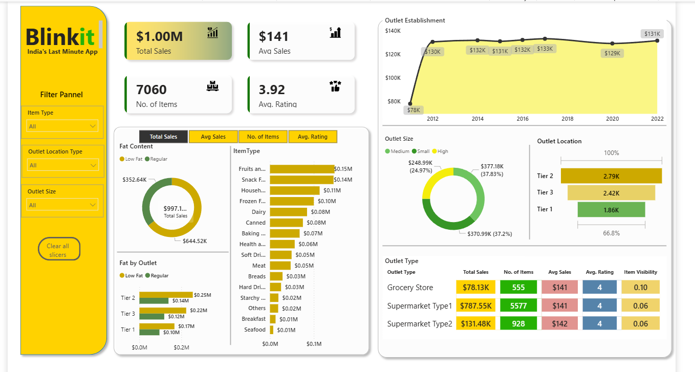

# Blinkit Power BI Dashboard 📊

## Project Overview

This project presents an interactive Power BI dashboard developed to analyze Blinkit's retail sales performance and customer purchasing trends. The dashboard transforms raw sales data into actionable business insights, helping stakeholders understand revenue distribution, outlet performance, product demand, and customer satisfaction metrics.

### Business Objective
The goal of this dashboard is to provide a comprehensive view of Blinkit's operational performance by tracking key business metrics and identifying growth opportunities through data-driven analysis.

---

## Dashboard Preview

---

## Key Performance Indicators (KPIs)

- 💰 Total Sales: $1.00M
- 📦 Total Items Sold: 7,060
- 📈 Average Sales: $141
- ⭐ Average Customer Rating: 3.92

---

## Key Insights

### Sales Analysis
- Analyzed overall sales performance across multiple outlet categories.
- Identified top-performing outlet locations and outlet sizes.

### Product Performance
- Compared sales contribution across different item categories.
- Evaluated product demand and visibility trends.

### Outlet Analysis
- Studied outlet establishment growth over time.
- Compared performance across Tier 1, Tier 2, and Tier 3 locations.

### Customer Insights
- Examined customer ratings and purchasing preferences.
- Evaluated the impact of product visibility on sales performance.

---

## Features

✔ Interactive Filters (Outlet Size, Outlet Location, Item Type)

✔ Dynamic KPI Cards

✔ Sales Trend Analysis

✔ Outlet Location Comparison

✔ Product Category Performance

✔ Customer Rating Analysis

✔ Data-Driven Business Insights

---

## Tools & Technologies

- Power BI
- Microsoft Excel / CSV
- Data Modeling
- Data Visualization
- Business Intelligence

---

## Repository Contents

| File | Description |
|--------|------------|
| Blinkit_Dashboard.pbix | Power BI Dashboard File |
| Blinkit_dashboard.png | Dashboard Screenshot |
| README.md | Project Documentation |

---

## Project Impact

This dashboard demonstrates practical skills in:
- Business Intelligence
- Data Analytics
- Dashboard Design
- Data Visualization
- KPI Reporting
- Decision Support Systems

---

## Author

**Pranav Kedar**

LinkedIn: www.linkedin.com/in/pranav-kedar

GitHub: https://github.com/pranavkedar31
